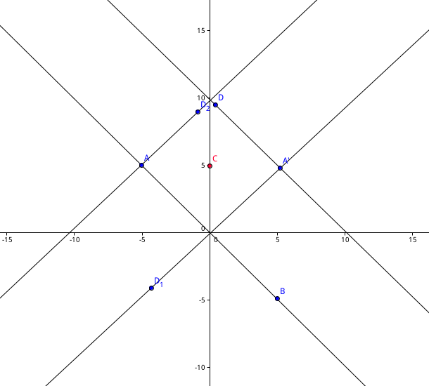

###【HDU5964】平行四边形

|Time Limit: 4000/2000 MS (Java/Others)   | Memory Limit: 65536/65536 K (Java/Others)|
|--


#### Problem Description
假设直线L和L'相交于原点O。假设S ={$s_1,s_2,...,s_n$}是平面上的n个点。你打 算找四个点满足如下条件：
1.   A ∈ L 而 A' ∈ L'。
2.   B,B'都属于S;即 B∈S 且B'∈S。
3.   A,A'的中点与B,B'的中点重叠。这意味着ABA'B'是一个平行四边形(或者退 化的平行四边形)。
4.  平行四边形ABA'B'的面积最大。
 

#### Input
包含多组测试数据。
第一行有4个整数a, b, a', b'，分别描述L和L'的坐标方程。具体来说，L的方程 为 ax + by = 0 ;而 L'的方程为 a'x + b'y = 0。
第二行有一个整数n。
接下来n行每行两个整数，表示一对坐标，描述S中的n个点。
保证n <= $10^6$，其他输入整数的绝对值不超过104;保证ab'≠ba'，a2+b2>0，a′2+b′2>0。
 

#### Output
输出一个整数，表示最大平行四边形的面积四舍五入到整数的值。
保证所有数据中，最大面积在四舍五入前的小数部分在[0,0.4] ⋃ [0.6,1)中。
 

#### Sample Input
1 0 0 1
5
1 1
-1 1
-1 -1
1 -1
0 0
 

#### Sample Output
2
Hint
 

####Source
2016年中国大学生程序设计竞赛（合肥）-重现赛（感谢安徽大学）


**题解：我们假设$A$在$l$上,$C(s,t)$，并且$A^‘$在$l^{‘}$上，过A点做平行于$l^{‘}$的平行线，过$A^‘$做平行于$l$的平行线,我们可以得到：**
**$$A=\begin{cases}ax+by =0 \\ cx+dy-2(cs+dt) =0\end{cases} \Rightarrow A = (\frac{2b(cs+dt)}{bc-ad},\frac{2a(cs+dt)}{ad-bc})$$**
**$$A^{'} = \begin{cases}cx+dy =0 \\ ax+by-2(as+bt) = 0\end{cases} \Rightarrow A^{'} = (\frac{2d(as+bt)}{ad-bc},\frac{2c(as+bt)}{bc-ad})$$**
**设$B=(x_3,y_3),B^{'} = (x_4,y_4)$,那么$s = \frac{x_3+x_4}{2},t = \frac{y_3+y_4}{2}$**
**$A = (\frac{bc(x_3+x_4)+bd(y_3+y_4)}{bc-ad},\frac{ac(x_3+x_4)+ad(y_3+y_4)}{ad-bc})$**
**$A^{'} = (\frac{ad(x_3+x_4)+bd(y_3+y_4)}{ad-bc},\frac{ac(x_3+x_4)+bc(y_3+y_4)}{bc-ad})$**
**显然四边形的面积为$S = |\vec{BA}\times\vec{BA^{'}}| =\frac{acx_3^2+bdy_3^2+(ad+bc)x_3y_3-(acx_4^2+bdy_4^2+(ad+bc)x_4y_4)}{ad-bc}$**
**$ad-bc$为定值，所以我们定义$f(x,y) = acx^2+dby^2+(ad+bc)xy$,那么题目就转化为求最大和最小的$f(x,y)$*
```
#include <bits/stdc++.h>

using namespace std;
const int INF = 0x3f3f3f3f;
typedef long long LL;
LL a,b,c,d;
LL Min,Max,x,y;
int main() {
    int n;
    while(~scanf("%lld %lld %lld %lld",&a,&b,&c,&d)) {
        scanf("%d",&n);
        Min = 1e17;
        Max = 0;
        for(int i = 0;i<n;i++) {
            scanf("%lld %lld",&x,&y);
            Min = min(Min,a*c*x*x+b*d*y*y+(a*d+b*c)*x*y);
            Max = max(Max,a*c*x*x+b*d*y*y+(a*d+b*c)*x*y);
        }
        printf("%lld\n",LL(fabs(1.0*(Max-Min)/(a*d-b*c))+0.5));
    }
    return 0;
}

```